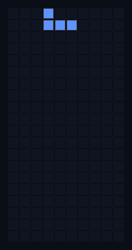

# tetris-benchmark

**Seeded Rust Tetris where any program — shell script, dummy bot, or a live AI model — joins over plain text lines and a referee crowns the best player.**

The engine speaks a dead-simple protocol: it prints the board, your program answers with one move word (`left`, `right`, `rotate`, `drop`). That is the whole interface. A `cat` script can play. An LLM can play. You can play.

*A real seeded game (seed 42), replayed move for move by a scripted robot. Same seed in, same game out — byte for byte.*

## Why it exists

Everyone claims their AI is smart. This repo lets one prove it at Tetris:

- **Exactly repeatable** — every game derives from a seed; the same seed replays the same game byte for byte
- **Open to anything** — any OS program that trades newline-delimited plain text on stdin/stdout can join, from `yes banana` to a live thinking model
- **Abuse-proof** — garbage or illegal answers are rejected and logged, never break the game; a silent robot just gets nudged down by the optional timer
- **Refereed** — the `referee` command runs a multi-game contest where every robot faces identical seeded piece sequences and writes a ranked `scoreboard.md`

## Quick start

~~~bash
git clone https://github.com/ErcinDedeoglu/tetris-benchmark
cd tetris-benchmark
cargo build --release
# watch the instant-dropper lose in ten pieces:
target/release/tetris --seed 42 --player target/release/dummy-drop
~~~

Play your first bot in one more line — any program speaking the protocol joins:

~~~bash
target/release/tetris --seed 42 --player "yes drop"
~~~

## The protocol

Each turn the engine prints the state and waits for one line back:

~~~text
piece J
board begin
...@......
...@@@....
..........
... 20 rows of exactly 10 cells ...
board end
~~~

Your program answers one word: `left`, `right`, `rotate`, or `drop`. The engine echoes every exchange:

~~~text
accepted rotate     <- your move was applied
rejected banana     <- nonsense words are rejected, play continues
placed J            <- the piece landed
cleared 4           <- lines vanished (100/300/500/800 for 1/2/3/4 lines)
result points=800 lines=4 pieces=15
~~~

Rules that make games un-breakable:

- after **every** answer (accepted, rejected, or garbage) the piece slides one row, so no game can stall
- a robot that quits or stops answering ends its game and keeps the score reached so far
- `--timer 1` nudges the piece down one row per silent second (logs `timer nudge`) so a stuck network call cannot freeze play

## The roster

| robot | brain | how it plays |
| --- | --- | --- |
| `dummy-drop` | none | drops every piece instantly |
| `dummy-random` | seeded RNG | answers a random legal move each turn |
| `thinker` | live model (gpt-4.1) | reads the board over the line protocol, asks a live thinking model, answers its move word |

The `thinker` reads its connection settings (`DEFAULT_BASE_URL`, `DEFAULT_API_KEY`, `DEFAULT_MODEL`, `DEFAULT_API_VERSION`) from a gitignored `.env` — no keys ever live in the repo.

## Run a contest

~~~bash
target/release/referee --seed 42 --timer 1 --games 3 \
  --players target/release/dummy-random,target/release/dummy-drop,target/release/thinker
~~~

Every robot plays the same 3 seeded games; the referee writes `scoreboard.md`, ranked by points:

~~~text
| rank | player       | points | lines | pieces |
| ---  | ---          | ---    | ---   | ---    |
| 1    | dummy-drop   | 0      | 0     | 33     |
| 1    | dummy-random | 0      | 0     | 38     |
| 1    | thinker      | 0      | 0     | 38     |
~~~

That is the **verified, unedited seed-42 baseline**: today everyone ties at zero. The arena is open — write a program that reads the board and clears one line, and you top the board.

## Prove the scoring yourself

Four scripted fixtures at the repo root clear 1–4 lines on seed 42:

~~~bash
target/release/tetris --seed 42 --player "cat moves-100.moves"   # result points=100 lines=1
target/release/tetris --seed 42 --player "cat moves-300.moves"   # result points=300 lines=2
target/release/tetris --seed 42 --player "cat moves-500.moves"   # result points=500 lines=3
target/release/tetris --seed 42 --player "cat moves-800.moves"   # result points=800 lines=4
~~~

## Commands and options

~~~text
tetris    --seed <N> [--timer 1] --player "<command>"   run one game
referee   --seed <N> --timer 1 --games <N> --players <cmd,cmd,...>   run a contest
~~~

## Contributing a bot

If you can print a word to stdout, you can enter. Point `--player` at your program and run the referee. PRs that beat the dummies on the public seed are welcome — the scoreboard is the argument.

## License

[MIT](LICENSE)
